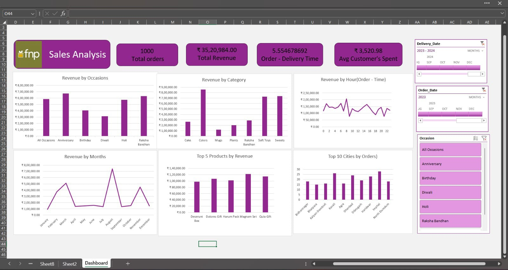

# 🎁 FNP Sales Analysis Dashboard

<p align="left">
  
  
  
  
</p>

An interactive Excel dashboard analyzing sales performance for **Ferns N Petals (FNP)** — India's leading gifting brand — across occasions, product categories, cities, and time periods.

---

## 📊 Dashboard Preview



---

## 📁 Project Structure

```
fnp-sales-analysis/
│
├── fnp_Dashboard.png         # Dashboard screenshot
├── orders.csv  # Order-level transaction data
├── customers.csv             # Customer demographics & details
├── products.csv              # Product catalog & category info
└── README.md                 # Project documentation
```

---

## 🔑 Key Metrics

| Metric | Value |
|--------|-------|
| 📦 Total Orders | 1,000 |
| 💰 Total Revenue | ₹35,20,984 |
| 🚚 Avg Order–Delivery Time | 5.55 days |
| 👤 Avg Customer Spend | ₹3,520.98 |

---

## 📈 Dashboard Components

### 1. Revenue by Occasions
Bar chart showing revenue split across **All Occasions, Anniversary, Birthday, Diwali, Holi, and Raksha Bandhan** — with Anniversary and Raksha Bandhan emerging as top drivers.

### 2. Revenue by Category
Highlights the best-performing product categories including **Sweets, Soft Toys, Raksha Bandhan sets, and Colors**, helping identify high-margin segments.

### 3. Revenue by Hour (Order Time)
Line chart revealing **peak ordering hours** throughout the day, useful for targeted marketing and operational planning.

### 4. Revenue by Months
Tracks monthly revenue trends across the year, exposing seasonal spikes (particularly around **August** for Raksha Bandhan and the festive season).

### 5. Top 5 Products by Revenue
Ranks the highest-grossing individual products:
- Deserunt Box
- Dolores Gift
- Harum Pack
- Magnam Set
- Quia Gift

### 6. Top 10 Cities by Orders
Bar chart of city-wise order volumes, covering cities like **Bhilainagar, Bhatpara, Kavali, Agra, Dhanbad, Dibrugarh, Haridwar, Imphal, Kalyan-Dombivli, and North Dumdum**.

---

## 🗂️ Dataset Description

### `orders` Dataset
| Column | Description |
|--------|-------------|
| Order ID | Unique transaction identifier |
| Customer ID | Linked customer reference |
| Product ID | Linked product reference |
| Occasion | Gift occasion (Birthday, Anniversary, etc.) |
| Order Date | Date the order was placed |
| Delivery Date | Date the order was delivered |
| Revenue | Total value of the order (₹) |

### `customers` Dataset
| Column | Description |
|--------|-------------|
| Customer ID | Unique customer identifier |
| Customer Name | Full name |
| City | Customer's city |
| Contact | Contact details |

### `products` Dataset
| Column | Description |
|--------|-------------|
| Product ID | Unique product identifier |
| Product Name | Name of the product |
| Category | Product category (Sweets, Cake, Mugs, etc.) |
| Price | Unit price (₹) |

---

## 🛠️ Tools & Techniques

- **Microsoft Excel** — PivotTables, PivotCharts, Slicers
- **Data Cleaning** — Handled missing values, standardized date formats
- **Data Modeling** — Relationships across Orders, Customers, and Products
- **Interactive Filters** — Delivery Date, Order Date, and Occasion slicers for dynamic exploration

---

## 💡 Key Insights

- 🎉 **Raksha Bandhan & Anniversary** are the highest-revenue occasions
- 🍬 **Sweets & Soft Toys** dominate category-level revenue
- 📍 **Tier-2 cities** contribute significantly to order volumes
- 🕐 Orders peak in the **late morning to afternoon** hours
- 📅 **August** sees the sharpest revenue spike due to festive demand

---

## 🚀 How to Use

1. Download or clone this repository
2. Open the Excel file containing the Dashboard sheet
3. Use the **Delivery Date**, **Order Date**, and **Occasion** slicers (right panel) to filter the view
4. All charts update dynamically based on slicer selection

---

## 👤 Author

**Santhi**
- GitHub: [github.com/santhi1701](https://github.com/santhi1701)
- Domain: Data Analytics | Excel Dashboards | Business Intelligence

---

> *This project was built as part of a data analytics portfolio to demonstrate skills in Excel-based dashboard design, data modeling, and business insight generation.*
